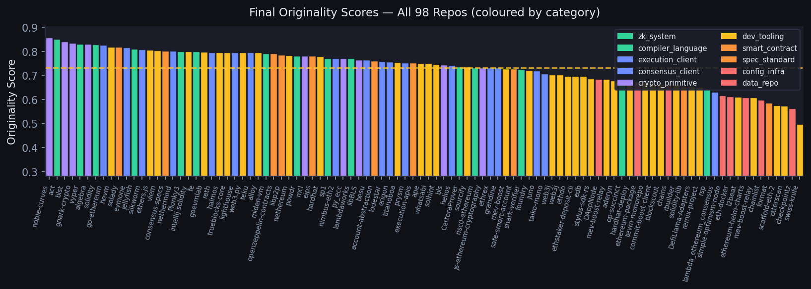
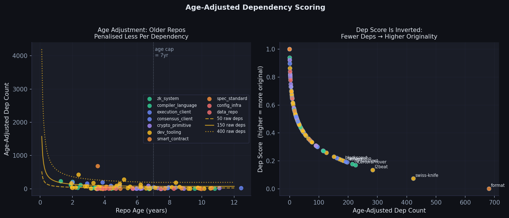
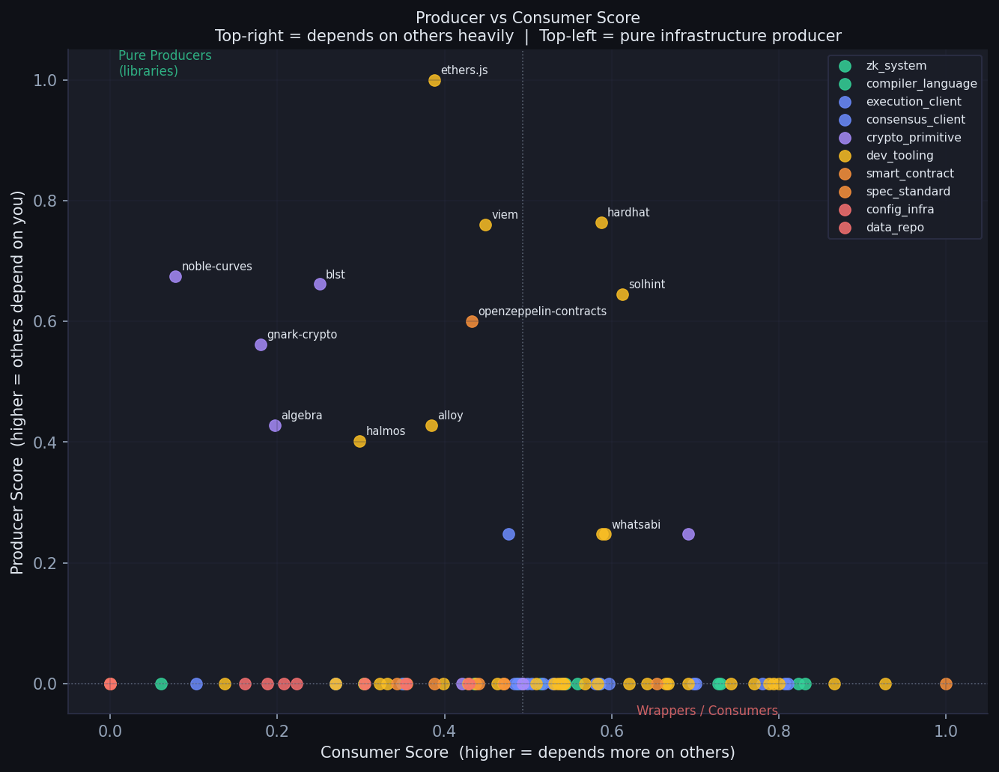
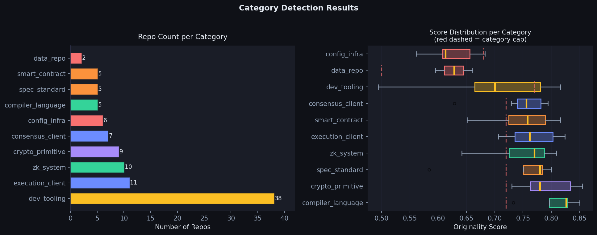

# Ethereum Ecosystem Originality Scoring Model

## 1. System Overview

The system predicts originality scores (0–1) for 98 Ethereum ecosystem repositories. It is composed of two Python programs working in sequence:

- **`usage_scores.py`** - clones all 98 repos, scans source code and measures how heavily each dependency is actually used. Outputs `usage_scores.csv`.
- **`originality.py`** - the main scoring model. Loads six CSV/JSON data sources, engineers features, runs a two-pass producer/consumer algorithm, classifies repos into categories, and computes a formula-based originality score tuned on 16 public jury anchors.

### The Core Intuition

Early in this project I made a mistake that immediately clarified everything. My first draft scored dependency count as a positive signal, more dependencies meant more interconnected, more important. Within minutes of running it, `scaffold-eth-2` and `ethereum-helm-charts` were near the top of the rankings.

That was obviously wrong. A Docker Compose file wrapping existing Ethereum clients is not more original than the execution client itself.

Flipping the dependency signal - more outbound dependencies → lower originality. It instantly produced rankings that made intuitive sense. That single inversion became the backbone of the whole model.

> **Central thesis:** Original work in Ethereum is infrastructure that others depend on, built without heavily depending on others. A cryptographic primitive like `noble-curves` that `ethers.js`, `viem`, and dozens of other projects rely on is more original than a scaffolding template that glues them together.


*Figure 1: Final originality scores for all 98 repos.*

---

## 2. The Core Research Challenges

### A. Dependency Data Was Structurally Incomplete

The first and biggest problem: the dependency graph from the competition data had huge gaps. Many repos returned zero dependencies. This wasn't because they had none. it was because GitHub's dependency graph only covers repos that have a dependency manifest in a format GitHub can parse. Rust repos using `Cargo.lock`, Go repos using `go.sum`, and anything using private registries were systematically underrepresented.

**What failed first**

Initial versions of the model used the raw `depsdev_transitive_deps` column as the primary signal. This caused a cluster of Rust cryptographic libraries like `blst`, `gnark-crypto`, `noble-curves`  to score near-zero because they appeared to have no dependencies. They're actually foundational primitives that everyone else depends on.

I addressed this in three ways:

- **Solution 1 - deps.dev Integration.** The deps.dev dataset provided package-level dependency counts for ecosystems GitHub misses. I mapped repos to their npm, Cargo, Go, Maven and PyPI packages and pulled transitive dep counts from deps.dev. This recovered signal for JavaScript/TypeScript and Java repos that the graph data had missed.

- **Solution 2 - Cargo.lock Parsing.** Rust repos frequently returned zero from both GitHub's graph and deps.dev. The real dependency complexity lives in `Cargo.lock`, which is the fully resolved transitive dependency tree. I fetched raw `cargo_lock_data.csv` containing total package counts per repo. A Rust repo with 350 Cargo.lock packages actually has meaningful dependency complexity.

- **Solution 3 - go.sum Analysis.** Go module dependencies are similarly undercounted. The `go.sum` file records the full set of resolved modules. I used `go_sum_unique_modules` as a fallback dep count for Go repos where the primary graph data showed zero.

### B. Ecosystems Measure Dependency Differently

A Rust repo with 400 `Cargo.lock` entries is not comparable to a Java Maven project with 400 dependencies.

I scaled each ecosystem's dep count before using it:

| Source | Scale Factor | Rationale |
|---|---|---|
| Cargo.lock packages | ×0.30 | Very granular, inflates count heavily |
| go.sum modules | ×0.40 | Moderately granular |
| Maven transitive | ×0.80 | Closer to 1:1 with logical deps |
| Others | ×1.00 | No scaling |

Getting this wrong in early versions caused Rust repos to score systematically lower than equivalent Go and Python repos simply because their lock files counted more packages.

Whichever source had a non-zero value first was used. This produced a `unified_dep_count` for every repo.

**Age-Adjusted Dependency Scoring**

A critical insight that took several model versions to implement correctly: old repos accumulate dependencies over time. A repo that's been actively developed for 10 years will have more dependencies than an equivalent 2-year-old repo, not because it's less original, but because it's been around longer to accumulate them.

Penalising `geth` (12 years old, 300+ dependencies) the same as a 6-month-old wrapper with the same count would be wrong. My solution:

```
age_adj_dep_count = scaled_dep_count / log1p(min(age_years, 7.0))
```

The cap at 7 years prevents runaway inflation for very old repos. Beyond 7 years, the age benefit is capped. This avoids any single repo getting an extreme advantage from longevity alone.


*Figure 2: Left - the same raw dep count scores differently depending on repo age. Old repos get their dep count divided by `log1p(age)`, reducing the penalty. Right - the dep score is inverted: fewer (age-adjusted) dependencies → higher originality score.*

The dependency signal ultimately feeds into the score as an inverted metric. More dependencies means the repo is more of a consumer of others' work, so the dep score component is:

```
dep_score = 1.0 - log1p(age_adj_dep_count) / log1p(max_age_adj_dep)
```

This single feature carries the highest weight in the final formula (`0.35`), reflecting its importance as the primary structural proxy for originality.

---

## 4. AI-Assisted Originality Inference

Structural signals alone can't detect what a repo actually does. A cryptographic library and a deployment script can look identical from a dependency graph perspective. I added a semantic layer using an LLM ensemble to extract originality signals from each repo's README and description.

### Multi-LLM Ensemble Approach

I used multiple models (DeepSeek, Llama, Mistral) and took ensemble consensus on binary signals. Using multiple models reduces the chance that one model's biases dominate, if two of three models agree a repo "implements from scratch," that's a stronger signal than a single model's verdict.

### Signals Extracted

**Positive Signals** (boost score)
- `implements_from_scratch` - original implementation, not assembled
- `defines_new_protocol` - introduces a novel protocol or spec
- `has_novel_algorithms` - custom algorithms not lifted from elsewhere
- `is_foundational_infrastructure` - other ecosystem work builds on this

**Negative Signals** (penalise score)
- `is_wrapper_or_integration` - primarily wraps existing tools
- `is_template_or_scaffold` - boilerplate for others to fill in
- `is_glue_code_or_middleware` - connects things without adding logic
- `is_utility_library_only` - thin convenience layer

The negative signals were as important as the positive ones. Many repos that scored high on structural metrics (few deps, lots of code) turned out to be wrappers — the AI signals caught this where the formula would have otherwise missed it.

### The Hardest Calibration Problem: Foundational Crypto Libraries That Look Like Wrappers

The biggest semantic challenge I faced: repositories like `blst`, `gnark-crypto`, and `noble-curves` describe themselves in ways that superficially resemble wrappers. They say things like "bindings to the blst library" or "Go bindings for BLS signatures." A naive LLM reads this and flags `is_wrapper_or_integration = 1`.

I addressed this in two ways. First, I tuned the LLM prompts to distinguish between "bindings to external C libraries" (a true wrapper) versus "implements cryptographic primitives with optimised field arithmetic" (original work). Second, I used category detection to identify `crypto_primitive` repos and assign them appropriately, if a repo is in the `crypto_primitive` category, the `is_wrapper` signal is weighted more cautiously in the formula.

The final `ai_wrapper_coef` in the formula is `−0.10` (the strongest negative coefficient), but it's clipped to `±0.15` across all AI signals combined, preventing any single signal from dominating. The `ai_found_coef` (foundational infrastructure) sits at `+0.08`, specifically to counterbalance false wrapper flags on legitimate crypto primitives.

---

## 5. Usage-Based Dependency Importance (Layer 1)

Counting how many dependencies a repo declares tells you something. But it doesn't tell you whether those dependencies are actually used. I built a separate source-code scanning pipeline (`usage_scores.py`) specifically to answer: *"Does this repo actually use its dependencies heavily, or does it just list them?"*

### Repository Cloning and Static Analysis

I shallow-cloned all 98 seed repos and scanned their source code. For each `(repo, dependency)` pair, I measured:

- **Manifest declarations** - is it a production dep or dev-only?
- **Import statements** - does the code actually import the dependency?
- **Import aliases** - does it bind the import to a name (stronger signal than a bare import)?
- **Call frequency** - how many times does it call functions from that dependency?

These signals are weighted differently in the usage score:

```
raw_freq   = imports × 1  +  aliases × 2  +  calls × 3
file_score = file_weight × log1p(raw_freq)
```

Calls are triple-weighted because they're the strongest evidence of real usage. A repo that imports a library but never calls it might just have a stale dependency. A repo that calls a library 400 times is genuinely depending on it.

### File Location Weighting

Not all source files carry the same signal. A test file that uses a crypto library is not the same as core source code that builds on it. I weighted files by their location:

| Location | Weight | Rationale |
|---|---|---|
| Core directories (`src/`, `lib/`, `core/`, `internal/`) | 2.0 | Production logic - strong signal |
| Normal source files | 1.0 | Standard production code |
| Test / spec / example / bench | 0.3 | Usage here is weaker evidence |

Additionally, a **test-ratio penalty** halves the total score for any dependency where more than 80% of all call detections come from test files. This catches repos that list a library as a production dependency but only use it in their test suite.


*Figure 3: Producer score (how much others depend on you) vs consumer score (how much you depend on others), coloured by category. Repos in the top-left quadrant - high producer, low consumer - are pure infrastructure producers. Those in the bottom-right are heavy consumers (wrappers, config tools).*

### How Usage Feeds the Main Formula

The usage scores are aggregated per repo into a single `usage_signal`:

```
source_ratio = (deps with source_match) / total_deps
intensity    = log1p(avg_weighted_score) / log1p(max_avg + ε)
usage_signal = 0.5 × source_ratio + 0.5 × intensity
```

In the final formula, this signal carries a negative weight. A high `usage_signal` means the repo heavily uses its dependencies  which is a mild negative indicator for originality. Repos that don't use their dependencies much at all, but are themselves heavily used by others, are the most original by this logic.

---

## 6. Proxy Signal Engineering

After applying all automated methods, six repositories still had zero detected dependencies across all data sources.
For these, I assigned conservative manual proxy dep counts based on known ecosystem role:

| Repo | Proxy Dep Count | Rationale |
|---|---|---|
| `libBLS`, `mcl` | 50 | Complex C++ library, significant internal complexity |
| `blst` | 20 | Focused implementation, minimal external deps by design |
| `nimbus-eth2` | 400 | Full consensus client, equivalent complexity to prysm/lighthouse |
| `DAppNode` | 5 | Orchestration tool, structurally low-dep by design |
| `ethereum-package` | 5 | Kurtosis package |
| `simple-optimism-node` | 3 | - |

These proxies were minimised and documented. I used the smallest defensible number rather than inflating scores. The Nimbus proxy (400) is the only aggressive one. But a full consensus client with Nim's package ecosystem genuinely has hundreds of logical dependencies even if they don't show up in automated scanning.


*Figure 4: Left - repo count per category. Right - score distribution per category with category caps overlaid. ZK systems and execution clients cluster near their cap; config/infra and data repos sit far below theirs.*


*Figure 5: Mean contribution of each feature to the raw score across all 98 repos. Dep score dominates, as intended. AI signals and usage contribute smaller but meaningful adjustments.*


*Figure 6: The soft cap mechanism. Rather than hard-clipping scores at the category ceiling, scores above the cap continue to grow at 40% of the normal rate. This preserves relative ordering within a category without any single repo hitting 1.0.*


*Figure 7: Final tuned weights from the grid search. The `dep_weight` (0.35) and `ai_wrapper_coef` (−0.10) are the two most-searched parameters. Everything else was fixed based on domain reasoning.*


*Figure 8: The 15 highest and 15 lowest-scoring repos. Top repos are ZK systems, execution clients, and crypto primitives. Bottom repos are data registries, config wrappers, and infrastructure templates.*

---

## 8. Challenges Encountered

- **Rust workspace parsing complexity.** Large Rust monorepos (e.g. `reth`) have nested `Cargo.toml` files across dozens of workspace members. Naive counting inflated their dep count because the same dependency appeared in multiple workspace manifests. I de-duplicated at the workspace level.
- **Inconsistent ecosystem metadata from deps.dev.** Some repos appeared under different slugs in deps.dev vs GitHub.
- **README noise in AI signal extraction.** Many repos have marketing-style READMEs that obscure their actual technical nature. Repos that say "easy to use" and "quick start" aren't necessarily low-originality, they just have better documentation. I downweighted `README_LOW` keywords and capped the `readme_bonus` at `±0.06`.
- **AI model calibration instability.** Different model runs on the same repo sometimes gave different binary signal values. I used ensemble voting across multiple models and found that the 3 most important signals (wrapper, foundational, scratch) had the highest agreement rate.
- **Normalization instability with small subsets.** When testing on subsets of repos, the normalization constants shifted significantly, making weight tuning results non-transferable. I added a minimum floor to `_MAX_LOG_DEP` (`log1p(400)`) to stabilise this.
- **16 jury anchors is a very small calibration set.** This was the fundamental constraint the entire model design had to work around. With 15+ parameters, any unconstrained optimizer will overfit. I fixed 13 of 15 weights based on domain reasoning and only grid-searched the 2 most sensitive parameters.

---

## 9. What I Built

1. **Multi-source dependency unification.** Rather than accepting whatever dep count GitHub provides, I built a priority hierarchy across 5 data sources and reconciled them into a single comparable signal.
2. **Ecosystem-aware scaling.** Rust, Go, Maven, and PyPI all report "dependencies" differently. The scaling factors prevent any one ecosystem from dominating the rankings.
3. **Two-pass weighted producer scoring.** Being depended on by `geth` counts more than being depended on by a config script. The second pass re-weights inbound edges by the source repo's own producer score, creating a quality-adjusted centrality measure.
4. **Source-code usage intensity.** Instead of just counting declared dependencies, I measured actual usage in source code like imports, aliases, and call frequency, weighted by file importance. This distinguishes real dependencies from stale or test-only ones.
5. **Soft category caps instead of hard clips.** Repos can exceed their category ceiling; they just do so at a reduced rate. This preserves relative ordering within categories without clipping information.

---

## 10. Known Limitations


- A repo can have few dependencies and still be doing unoriginal work (copy-pasting code instead of importing it). The model can't detect plagiarism or code similarity.
- The usage scanner can detect that a repo imports `tokio` and calls `tokio::spawn`, but it can't tell whether that use is architecturally central or incidental. Dynamic analysis would give better signal but isn't feasible at this scale.
- The LLM ensemble may have systematic biases toward or against certain kinds of repos.
- Nim (used by `nimbus-eth2`, `status-im`) has almost no automated dependency tracking. OCaml, Haskell, and Elixir repos are similarly underserved. These required manual proxy estimates.
- The jury anchors used for calibration are the publicly disclosed ones, which does not cover the full diversity of the 98 repos (e.g. there may be no anchor for the `data_repo` or `config_infra` categories).
